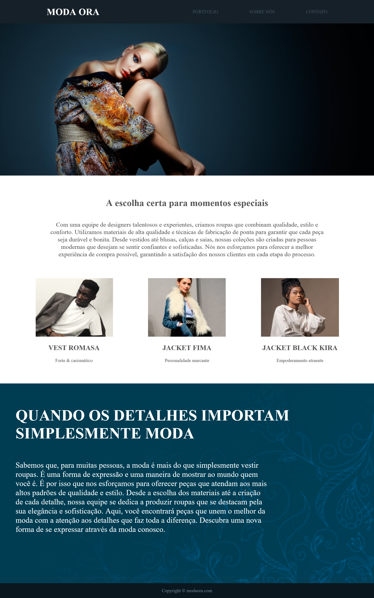

# Moda Ora – Landing Page de Moda 👗✨

Este projeto consiste em uma **landing page estática** desenvolvida utilizando **HTML e CSS puro**, com foco na **interface visual** de uma marca fictícia de moda chamada **Moda Ora**.

O projeto trabalha layout, tipografia e organização visual, simulando o site institucional de uma marca do segmento fashion.

---

## 📸 Preview do Projeto

---

## 🧠 O que o projeto apresenta

A página é composta por seções bem definidas, comuns em sites de moda e marcas institucionais:

- **Header** com logotipo e menu de navegação
- **Seção hero** com imagem em destaque
- **Seção institucional** explicando a proposta da marca
- **Vitrine de produtos** com cards
- **Seção conceitual** com texto e identidade visual forte
- **Footer** simples com direitos autorais

---

## 🎯 Objetivo do projeto

- Praticar **HTML e CSS do zero**
- Desenvolver uma **landing page institucional**
- Trabalhar conceitos de:
  - Layout
  - Tipografia
  - Hierarquia visual
  - Estrutura semântica
- Criar um projeto visual para **portfólio iniciante**

---
